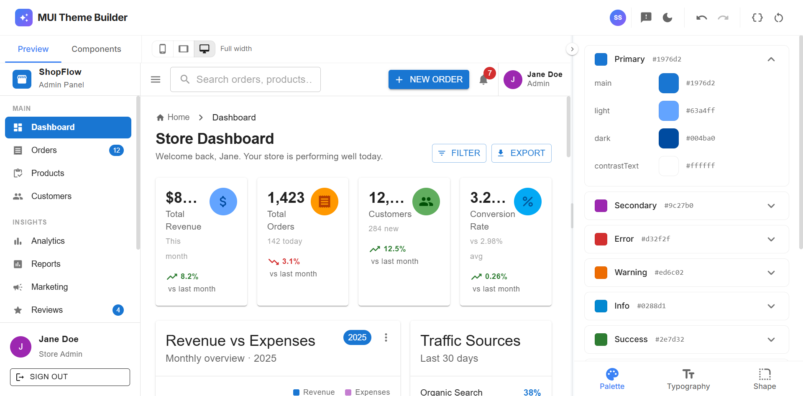

  ---
  # MUI Theme Builder

  A free visual theme editor for [Material UI 
  (MUI)](https://mui.com).
  Customize palette, typography, and shape — preview
   live, export production-ready code.

  **[MUI Theme Builder](https://mui-theme-builder.vercel.app)**

  

  ---

  ## Features

  ### Palette Editor
  - Edit all 6 semantic color roles — primary,
  secondary, error, warning, info, success
  - Control background, text, divider, common
  colors, and the full grey scale
  - HEX, RGBA, and HSLA input modes with a color
  picker
  - Auto-generate light/dark/contrastText from any
  main color
  - Per-color reset buttons, recently used colors

  ### Typography
  - Pick any Google Font via autocomplete — or type
  any font name
  - Control base font size and per-variant styles
  (size, weight, line height, letter spacing)
  - Live font preview panel

  ### Shape & Spacing
  - Global border radius with Sharp / Default /
  Rounded / Pill presets
  - Spacing unit slider
  - Live shape preview

  ### Live Preview
  - Full e-commerce dashboard driven entirely by
  your theme
  - Device modes — Mobile (390px), Tablet (768px),
  Desktop (full width)
  - Realistic device frames with dynamic island,
  status bar, volume buttons

  ### Component Showcase
  - 35 interactive MUI component demos — Inputs,
  Data Display, Feedback, Navigation
  - Every demo renders inside your live theme
  instantly
  - Search, pin, and deep-link to any component

  ### Export
  - 10+ export formats — JS, TS, JSX, Styled
  Components, Emotion, CSS Variables,
    Tailwind config, Figma Tokens, and more
  - Monaco editor with syntax highlighting
  - Copy to clipboard or download as file

  ### Other
  - Light / Dark mode toggle
  - Theme persists across sessions (localStorage)
  - Fully responsive — works on mobile

  ---

  ## Reporting Issues & Feature Requests

  Found a bug or have an idea?
  **[Open an issue →](../../issues)**

  Please include:
  - For bugs: what you did, what you expected, what
  happened (+ browser/OS)
  - For features: what you want and why it would be
  useful

  ---

  ## Roadmap

  Active development is ongoing. Planned features
  include undo/redo, saved named
  themes, share via URL, WCAG contrast badges, and
  more.

  Follow this repo (Watch → Custom → Issues) to get
  notified of updates.

  ---
